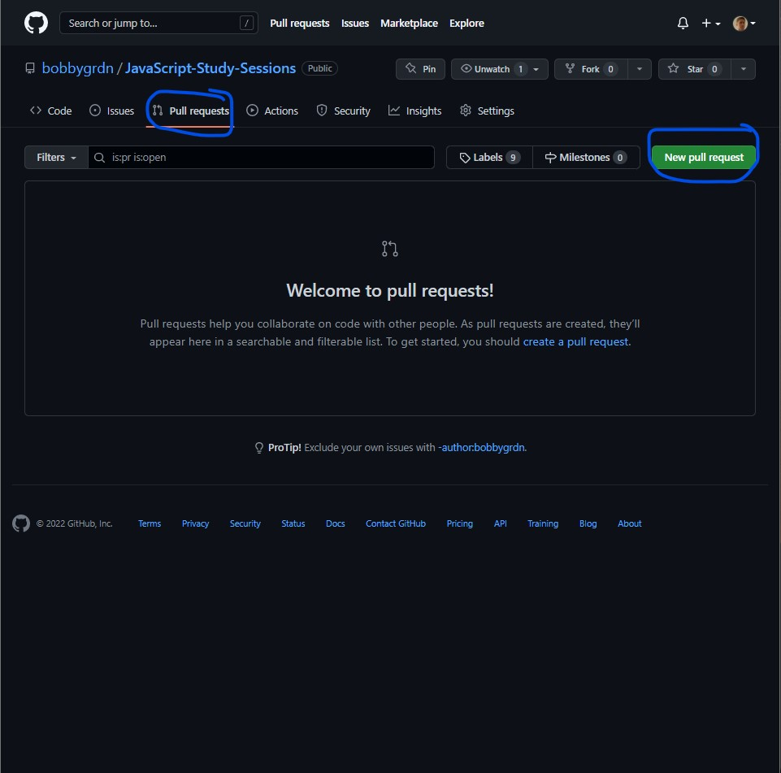
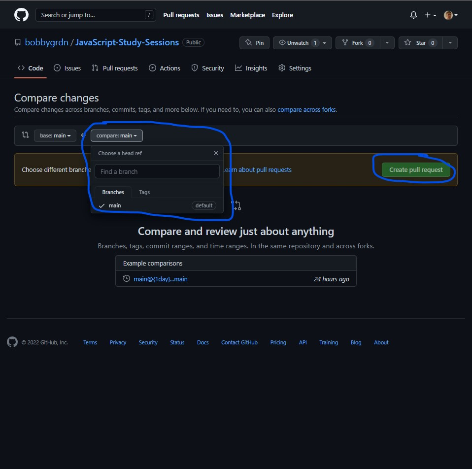

# Basics

Learning the basics is crucial when learning any programming language and to start your career as a developer. Building a solid foundation of knowlege in the fundamentals will help you learn more advanced technologies, frameworks and algorithms in the future.
This documentation will walk you through the basics of JavaScript, The Command Line Interface(CLI), Git and Github.

### Table of Contents
  * [Linking JavaScript to HTML](#linking-javascript-to-html)
  * [Adding Pseudocode](#adding-pseudocode)
  * [Methods to interact with the console](#methods-to-interact-with-the-console)
  * [Data Types](#data-types)
    + [Primitive Data Types(Passed by value)](#primitive-data-types)
    + [Non-Primitive Data Types (Passed by reference)](#non-primitive-data-types)
    + [Variables](#variables)
      - [Variable Types/Reassignment](#variable-types-reassignment)
      - [Scope](#scope)
      - [Operators](#operators)
      - [Loops](#loops)
      - [Conditionals (Checks pieces of logic and returns a certain value if that condition is met)](#conditionals--checks-pieces-of-logic-and-returns-a-certain-value-if-that-condition-is-met-)
      - [Basic Functions](#basic-functions)
      - [Methods](#methods)
      - [Concatenation (There are several ways to concat different elements, here are three great methods)](#concatenation--there-are-several-ways-to-concat-different-elements--here-are-three-great-methods-)
      - [Array.join( ) -> Joins the elements in the given array and turns them into a string](#arrayjoin-------joins-the-elements-in-the-given-array-and-turns-them-into-a-string)
      - [string.concat() -> Uses a selected string to start with and adds the input element(s)](#stringconcat------uses-a-selected-string-to-start-with-and-adds-the-input-element-s-)
      - [Statements (Statements are separated by ';' and are usually on seperate lines as well)](#statements--statements-are-separated-by-----and-are-usually-on-seperate-lines-as-well-)
      - [Expressions (valid sets of literals, variables, operators and expressions that evaluate to a single value)](#expressions--valid-sets-of-literals--variables--operators-and-expressions-that-evaluate-to-a-single-value-)
  * [Command Line Interface (CLI) Commands](#command-line-interface--cli--commands)
      - [ls (list)](#ls--list-)
      - [cd (Change Directory)](#cd--change-directory-)
      - [pwd (Print Working Directory)](#pwd--print-working-directory-)
      - [mv (Move)](#mv--move-)
      - [cp (Copy)](#cp--copy-)
      - [touch (Create file)](#touch--create-file-)
      - [mkdir (Make directory)](#mkdir--make-directory-)
      - [code .](#code-)
      - [npm install](#npm-install)
      - [npm uninstall](#npm-uninstall)
  * [Git & Github](#git---github)
      - [Repositories (repos)](#repositories--repos-)
      - [Git Commands](#git-commands)
        * [clone (Used to clone remote repos down to your local machine)](#clone--used-to-clone-remote-repos-down-to-your-local-machine-)
        * [pull (Used to pull down any updates to the remote repo into your local repo)](#pull--used-to-pull-down-any-updates-to-the-remote-repo-into-your-local-repo-)
        * [push (Used to push changes from your local repo into the remote repo)](#push--used-to-push-changes-from-your-local-repo-into-the-remote-repo-)
        * [add remote (Used to add a link between your local repo and a remote repo)](#add-remote--used-to-add-a-link-between-your-local-repo-and-a-remote-repo-)
        * [commit (Used to commit changes from your local repo to be pushed up to the main repo)](#commit--used-to-commit-changes-from-your-local-repo-to-be-pushed-up-to-the-main-repo-)
        * [branch (Used to interact with the curent branch(s) of your local repo)](#branch--used-to-interact-with-the-curent-branch-s--of-your-local-repo-)
      - [GitHub Actions (Actions to take on GitHub to interact with remote repos)](#github-actions--actions-to-take-on-github-to-interact-with-remote-repos-)
        * [Fork (Used to create a fork or copy of the selected remote repo and put that copy into your remote directory)](#fork--used-to-create-a-fork-or-copy-of-the-selected-remote-repo-and-put-that-copy-into-your-remote-directory-)
        * [Clone (Used to get the remote repo url to clone down onto your local machine)](#clone--used-to-get-the-remote-repo-url-to-clone-down-onto-your-local-machine-)
        * [Pull request (Used to make a request to update/change information in the main branch from your current branch)](#pull-request--used-to-make-a-request-to-update-change-information-in-the-main-branch-from-your-current-branch-)

## Linking JavaScript to HTML

```javascript
This is how it will look if you put your script in the body tag
<!DOCTYPE html>
<html lang="en">
<head>
    <meta charset="UTF-8">
    <meta http-equiv="X-UA-Compatible" content="IE=edge">
    <meta name="viewport" content="width=device-width, initial-scale=1.0">
    <title></title>

</head>
<body>
    <script type="text/javascript">
        // javascript code will code here
    </script>
</body>
</html>
```

```javascript
This is how it will look if you link your script in the body tag
<!DOCTYPE html>
<html lang="en">
<head>
    <meta charset="UTF-8">
    <meta http-equiv="X-UA-Compatible" content="IE=edge">
    <meta name="viewport" content="width=device-width, initial-scale=1.0">
    <title></title>
    <script defer src="script.js"></script>
</head>
<body>

</body>
</html>
```

## Adding Pseudocode

```javascript
// -> This is used to add single line comments into your code
```

```javascript
/** This is how you
 * can add multiple
 * line comments
 */
```

## Methods to interact with the console

console.log( ) -> Used to log statements to the console. Great for debugging code.

```javascript
console.log("Any comment or statement I want to make to the console");
```

console.table( ) -> Used to see data in an organize and digestible manner. Great for objecs, arrays or JSON.

```javascript
console.table({0: 'Name', 1: 'Age', 2: 'Gender'});

// This returns the following table:
______________________
| (index)  | Values  |
|----------|---------|
|    0     |  'Name' |
|    1     |  'Age'  |
|    2     | 'Gender'|
|__________|_________|
```

console.assert( ) -> Used to check a conditional and log a statement if the result is false

```javascript
let num = 10;
console.assert(num < 5, "num is greater than 5");

// This returns the following statement:
Assertion failed: num is less than 5
```

console.count( ) -> Used to count how many times an operatons is being run. Great to keep track of loops.

```javascript
let array = [5, 65, 7, 5, 7, 4, 85, 4, 85];

for (let i = 0; i < array.length; i++) {
  console.count("Count");
}

// This returns statements that look like this:
Count: 1;
Count: 2;
Count: 3;
Count: 4;
Count: 5;
Count: 6;
Count: 7;
Count: 8;
Count: 9;

// This tells me my loop ran 9 times which let me loop over every element in the array.
```

console.error( ) -> Used to detect errors and logs what that error is to the console.

```javascript
let num1 = 30, num2 = 57;
if(num2 < 50) {
    console.log(num2 - num1);
} else {
    console.error("Number 2 is too big!");
}

// This returns the following statement in the console:
Number is too big!

// This tells me that num2 was caught by my console.error() statement because it was too high of a number
```

## Data Types

### Primitive Data Types

Strings (A vaule surrounded by ' ' or " ")

```javascript
"Hello World!";

"This is a string!";

"Lets put one more string in here!";
```

Numbers

```javascript
2022;
45;
468;
```

Booleans (True or False)

```javascript
true;

console.log(10 > 5);
// This console log returns true because 10 is greater than 5

false;
console.log(20 === "20");
// This console log returns false because the first value is a number and the second is a string
```

Undefined

```javascript
let placeHolderText;
console.log(placeHolderText);
// This will console log undefined because the placeHolderText variable has been declared with no value
```

Null (An assignment value that can be used as a placeholder)

```javascript
null;
let currentSum = null;
// The value of currentSum is equal to null which means it has an empty but defined value.
```

### Non-Primitive Data Types

Object Literals (A value to a variable that is surrounded by { } )

#### Variable Assignment

```javascript
const newObj = {};
// This newObj variable has been defined with an empty object value
```

#### New Keyword

```javascript
const obj = new Object();
// This obj variable has been defined and given a value with the new object method
```

#### Accessing Properties

```javascript
const studentObject = {
    firstName: 'Charles',
    lastName: 'Robbins',
    age: '28',
    course: 'Web Dev'
};

'firstName' -> Property name of studentObject
studentObject.firstName; -> Charles
// This property value was accessed by using Dot Notation with the property name

'lastName' -> Property name of studentObject
studentObject['lastName']; -> Robbins
// This property value was accessed by using Bracket Notation with the property name
```

#### Adding Properties

```javascript
studentObject.school = "Galvanize";
// This adds a school property to the studentObject and sets the value to 'Galvanize'
```

#### Deleting Properties

```javascript
delete studentObject.course;
// This deletes the course property from the studentObject
```

Array Literals (A value to a variable that is surrounded by [ ] )

#### Variable Assignment

```javascript
const newArray = [];
// This newArray variable has been defined with an empty array value
```

#### New Keyword

```javascript
const arr = new Array();
// This arr variable has been defined and given a value with the new array method
```

#### Accessing Data (Data in arrays are accessed by index which follows a zero-index model)

```javascript
const numsArray = [586,687,844,9879,877];
numsArray[0]; -> 586
// The first index of the array which has an index of 0 has a value of 586

numsArray[2]; -> 844
// The third index of the array which has an index of 2 has a value of 844
```

### Variables

#### Variable Types/Reassignment

##### var (ES5 Suntax, Mutable)

```javascript
var name = "Christopher";
name = "Chris";
// var can be changed becuase it is a mutable variable assingment type
```

##### const (ES6, Used to define variables that should not be changed, Immutable)

```javascript
const lastName = "Robin";
lastName = "Smith";
// The value of lastName will still be Robin because const variables are immutable
```

##### let (ES6, Most used, Mutable, Block Scoped)

```javascript
let year = 2022;
year = 2023;
// The value of year will be 2023 because let is a mutable variable assignment type
```

#### Scope

##### Block Scope (Can only be accessed inside the block they are created in)

```javascript
const (cannot be accessed outside the block)
{const first_name = 'George'}
console.log(first_name)
// This will log an error because we are trying to access it outside the block

let (cannot be accessed outside the block)
{let x = 28}
console.log(x)
// This will log an error because we are trying to access it outside the block

var (can be accessed outside the block)
{var serial = 'A859'}
console.log(serial)
// This will console log A859 because var is not block scoped
```

##### Local/Function Scope (Can only be accessed inside the function they are created in)

```javascript
function test () {

    const test1 = 'George';

    let test2 = 28;

    var test3 = 'A859';
}

console.log(test1); -> This will return an error since the const variable is only accessed inside the function
console.log(test2); -> This will return an error since the let variable is only accessed inside the function
console.log(test3); -> This will return an error since the var variable is only accessed inside the function
```

##### Global Scope

```javascript
const age = 31;
let newString = 'Scoping!';
var i = 95469;

function test () {

    const test1 = 'George';

    let test2 = 28;

    var test3 = 'A859';
}

console.log(age); -> This will console log 31 since age is a global variable
console.log(newString); -> This will console log Scoping! since newString is a global variable
console.log(i); -> This will console log 95469 since i is a global variable
```

#### Operators

##### Increment Operator (Used to increase a given value. Used in loops and other methods.)

```javascript
'i++' -> Increases i by 1 each time it is called
'x+=3' -> Increases x by 3 each time it is called
'++y' -> Increases y by 1 each time it is called

let nums = [465,8749,164,987,165,9844,64]
for(i = 0; i < nums.length; i++) {
    let current = nums[i];
    console.log(current);
}
// We are using the increment operator in this for loop to iterate through a numbers array
```

##### Decrement Operator (Used to decrease a given value. Used in loops and other methods.)

```javascript
'i--' -> Decreases i by 1 each time it is called
'x-=3' -> Decreases x by 3 each time it is called
'--y' -> Decreases x by 1 each time it is called

let nums = [465,8749,164,987,165,9844,64]
for(x = nums.length -1; x < 0; x--) {
    let current = nums[x];
    console.log(current);
}
// We are using the decrement operator in this for loop to iterate through a numbers array in reverse
```

##### Comparison Operators (Used to compare two values.)

```javascript
'==' (Equal to)
10 == '10' -> true because the number 10 is contained in the string
10 == '20' -> false because the number 10 is not contained in the string

'===' (Equal value and type)
5 === 5 -> true because they are strictly equal by value and type
5 === '5' -> false because they are not strictly equal by value and type

'!==' (Not equal to)
10 != 20 -> true because 10 is not equal to 20
10 != '10' -> false because the number 10 is contained in the string

'!==' (Not equal value and type)
5 !== '5' -> true because one is a number and the other is a string
8 !== 5 -> true because the value of 8 is not equal to the value of 5

'>' (Greater than)
10 > 5 -> true beacuse 10 is greater than 5
5 > 20 -> false because 5 is not greater than 10

'<' (Less than)
5 < 10 -> true because 5 is less than 10
20 < 15 -> false because 20 is not less than 15

'>=' (Greater than or equal to)
10 >= 10 -> true because 10 is equal to 10
12 >= 8 -> true because 12 is greater than 8

'<=' (Less than or equal to)
12 <= 10 -> false because 12 is greater than 10
20 <= 22 -> true becasue 20 is less than 22
```

##### Logical Operators (Used to check multiple pieces of logic)

```javascript
'&&' (And)
10 > 5 && 20 < 30 -> true because both conditions are met
10 == '10' && 20 < 15 -> false because both conditions are not met

'||' (Or)
10 > 5 || 15 > 20 -> true because one of the conditions was met
'57' === 57 || 537 == '537' -> true because one of the conditions was met

'!' (Not)
!(5 == 5) -> false because the number 5 is in the string of 5
!(10 == 10) -> false because the two data types are not equal
```

##### Ternary Operator (Used to check logic and return result if true or false)

```javscript
let personAge = 22;
let ableToVote = (personAge < 18) ? 'They are too young': 'They are old enough';
// This will return 'They are old enough' since personAge is set to 22

let ageOfPerson = 15;
let ableToDrive = (ageOfPerson >= 16) ? 'They are too young': 'They are old enough';
// This will return 'They are too young' since ageOfPerson is set to 15
```

##### Modulo Operator (Used to find the remainder of two numbers. Great for checking if number is odd or even)

```javascript
6 % 3 -> Result should be a remainder of 0 because 6 is divisible by 3, 2 times with 0 remaining
// This method can be used to find that 6 is an even number

5 % 2 -> Result should be a remainder of 1 because 5 is divisible by 2, 2 times with 1 remaining
// This method can be used to find that 5 is an odd number

if(6 % 2 === 0) {
    console.log('Even number!');
} else {
    console.log('Odd number!')
}
// This would console log Even number! since 6 can be divided by 2 with no remainders
```

##### Assignment Operator (Used to assign values to variables. Can be great for concating strings and computing math logic)

```javscript
'=' (Basic Assignment)
let nums = [6,12];
const numObj = { x: 12, y: 26 };

'+=' (Addition Assignment)
let y = 3;
let x = 4;
x += y;
console.log(x); -> console logs 7 because we added x and y together

let string1 = 'Hello '
let string2 = 'World'
string1 += string2
console.log(string1) -> console logs Hello world because we added string2 to string1

'-=' (Subtraction Assignment)
let a = 3;
let b = 4;
b -= a;
console.log(b) -> console logs 1 because we subtracted a from b

'*=' (Multiplication Assignment)
let e = 3;
let f = 4;
e *= f;
console.log(e) -> console logs 12 because multiplied e and f

'/=' (Division Assignment)
let g = 12;
let o = 4;
g /= o;
console.log(g) -> console logs 3 because we divided g by o
```

#### Loops

##### For loop (Loops over an object or an array and enacts whatever code you input to each element)

```javascript
let numArray = [8845, 87, 9874864, 98746, 15, 68465];

for (let i = 0; i < numArray.length; i++) {
  let current = numArray[i];
  console.log(current + 100);
}
// This returns statements that look like this:
8945;
187;
9874964;
98846;
115;
68565;
```

##### For in (Loops over an object literal and enacts whatever code you input to each element)

```javascript
let namesObject = {
    0: 'James Harden',
    1: 'Smith Robbins',
    2: 'Alicia Romanov',
    3: 'Michael Simmons'
}
for (let key in namesObject) {
    const current = namesObject[key];
    console.log('Manager: ' + current);
}

// This returns statements that look like this:
Manager: James Harden
Manager: Smith Robbins
Manager: Alicia Romanov
Manager: Michael Simmons
```

##### For of (Loops over an array and enacts whatever code you input to each element)

```javascript
let namesArray = ['James Harden','Smith Robbins','Alicia Romanov','Michael Simmons'];

for (let name of namesArray) {
    console.log('Manager: ' + name);
}

// This returns statements that look like this:
Manager: James Harden
Manager: Smith Robbins
Manager: Alicia Romanov
Manager: Michael Simmons
```

##### For each (Loops over an array and enacts a given callback function on each element)

```javascript
let managerArray = ['James Harden','Smith Robbins','Alicia Romanov','Michael Simmons']

function addPostiion(name) {
    console.log("Manager: " + name)
}

managerArray.forEach(addPostiion)

// This returns statements that look like this:
Manager: James Harden
Manager: Smith Robbins
Manager: Alicia Romanov
Manager: Michael Simmons
```

##### While (Performs a certain action while the current condition is being met)

```javascript
let number = 100;

while (number > 90) {
    console.count('Still too high!')
    number--
}

// This returns statements that look like this:
Still too high!: 1
Still too high!: 2
Still too high!: 3
Still too high!: 4
Still too high!: 5
Still too high!: 6
Still too high!: 7
Still too high!: 8
Still too high!: 9
Still too high!: 10
```

##### Do while (Performs a certain action while the current condition is being met)

```javascript
let newNumber = 20;

do {
    console.count('Still going');
    newNumber--;
} while (newNumber > 8)

// This returns statements that look like this:
Still going: 1
Still going: 2
Still going: 3
Still going: 4
Still going: 5
Still going: 6
Still going: 7
Still going: 8
Still going: 9
Still going: 10
Still going: 11
Still going: 12
```

#### Conditionals (Checks pieces of logic and returns a certain value if that condition is met)

##### If statement

```javascript
const numvar = 10

if(numvar > 6) {
    console.log('Its higher!!');
}

// This consitional statement returns:
It's higher!!
```

##### If else statement

```javascript
const numvar = 10

if(numvar > 15) {
    console.log('Its higher!!');
} else {
    console.log('Its not high enough!!');
}

// This consitional statement returns:
Its not high enough!!
```

##### Else if statement

```javascript
const numvar = 10

if(numvar > 15) {
    console.log('This is too high!!');
} else if(numvar < 12) {
    console.log('This isnt high enough');
} else {
    console.log('This is just right');
}

// This consitional statement returns:
This isnt high enough
```

#### Basic Functions

##### Input/Parameters

```javascript
Input(s) or Argument(s) (The passed in value(s) used when invoking/calling a function)

const someNamesArr = ['Robert', 'George', 'Samantha', 'Tom'];

function intros(arr) {
    for(let i = 0; i < arr.length; i++) {
        console.log('Hello my name is ' + arr[i]);
    };
};

intros(someNamesArr);

// This function after it is invoked will return statements that look like this:
Hello my name is Robert
Hello my name is George
Hello my name is Samantha
Hello my name is Tom
```

##### Parameter(s)

```javascript
Parameter (The passed in value(s) used when creating the function)

function newIntros(arr) {
    for(let i = 0; i < arr.length; i++) {
        console.log('Hello my name is ' + arr[i]);
    };
};

newIntros(someNamesArr);

// This function after it is invoked will return statements that look like this:
Hello my name is Robert
Hello my name is George
Hello my name is Samantha
Hello my name is Tom
```

##### Layout

```javascript
function basicFunction(parameter(s)) {
    // Code using the parameter(s)
    return -> return statement is used to return the result or end product of a function
}
```

##### Invoking/Calling

```javascript
function anotherFunction() {
    console.log('My first function!');
};

anotherFunction() -> This line is calling/invoking the anotherFunction to be used
```

#### Methods

##### String Methods

```javascript
concat() -> Used to combine multiple strings together

const str1 = 'Hello';
const str2 = 'there!';

console.log(str1.concat(' ', str2)) -> console logs Hello there!
```

```javascript
indexOf() -> Finds the index of the given value inside the string the method is called upon

const str1 = 'Hello';
const str2 = 'there!';

console.log(str1.indexOf('e')) -> console logs 1 since it is the index of e in str1
console.log(str2.indexOf('r')) -> console logs 3 since it is the index of r in str2
```

```javascript
split() -> Splits the string into substrings based on the input used

const str1 = 'Hello';
const str2 = 'there!';

console.log(str1.split('')) -> console logs an array of substrings of each letter ['H','e','l','l','o']
console.log(str2.split('e')) -> console logs an array of substrings that are not equal to e ['t','h','r','!']
```

```javascript
toLowerCase() -> Changes any uppercase letters in the string to lowercase

const str1 = 'Hello';
const str2 = 'there!';

console.log(str1.toLowerCase()) -> console logs str1 in a total lowercase format
console.log(str2.toLowerCase()) -> console logs str2 in a total lowercase format
```

```javascript
toUpperCase() -> Changes any lowercase letters in the string to lowercase

const str1 = 'Hello';
const str2 = 'there!';

console.log(str1.toUpperCase()) -> console logs str1 in a total uppercase format
console.log(str2.toUpperCase()) -> console logs str2 in a total uppercase format
```

##### Array Methods

```javascript
unshift() -> Adds new element(s) to the front an the array

const numbersArray = [45,68,78,35,48]

numbersArray.unshift('x', 89)
console.log(numbersArray) -> console logs ['x', 89,45,68,78,35,48] 'x' and 89 were added
```

```javascript
shift() -> removes element(s) from front of an array

const numbersArray = [45,68,78,35,48]

numbersArray.shift()
console.log(numbersArray) -> console logs [89,45,68,78,35,48] 'x' was removed
```

```javascript
push() -> adds element(s) to end of an array

const numbersArray = [45,68,78,35,48]

numbersArray.push('Hello world')
console.log(numbersArray) -> console logs [89,45,68,78,35,48, 'Hello world']
```

```javascript
pop() -> removes element(s) from end of an array

const numbersArray = [45,68,78,35,48]

numbersArray.pop()
console.log(numbersArray) -> console logs [89,45,68,78,35,48]
```

```javascript
slice() -> returns a copy of the array based off of the inputs

const numbersArray = [45,68,78,35,48]

console.log(numbersArray.slice(2)) -> console logs [68,78,35,48] which is the array starting with index 2
```

```javascript
splice() -> removes element(s) and replaces and or adds new element(s)

const numbersArray = [45,68,78,35,48]

numbersArray.splice(1, 0, 'Hello!')
console.log(numbersArray) -> console logs [89,'Hello!',45,68,78,35,48]
```

```javascript
filter() -> filters array based upon input statement

const numbersArray = [45,68,78,35,48]

console.log(numbersArray.filter(elem => elem < 60)) -> Returns an array with numbers that are less than 60
```

```javascript
map() -> maps out the array and uses an input method or parameters to change what is in that array

const numbersArray = [45,68,78,35,48]

console.log(numbersArray.map(elem => elem * 2)) -> Returns an array with each number multiplied by 2 [90,136,156,70,96]
```

```javascript
forEach() -> Iterates through an array and uses a method or called function on each element in that array

const numbersArray = [45,68,78,35,48]

console.log(numbersArray.forEach(elem => console.log(elem)))
console logs the following statements:
45
68
78
35
48
```

```javascript
reverse() -> Reverses the order of the array

const numbersArray = [45,68,78,35,48]

console.log(numbersArray.reverse())
```

```javascript
toString() -> Converts the array into a string

const numbersArray = [45,68,78,35,48]

console.log(numbersArray.toString()) -> Console logs 89,45,68,78,35,48
```

##### Object Methods

```javscript
assign() -> Assigns all properties from an object(s) to a target object

const thisObject = {
    A: 23,
    B: 58,
    C: 82
}

const anotherObject = {
    D: 358,
    E: 465
}

const combine = Object.assign(anotherObject, thisObject);
console.log(anotherObject); -> Returns the combined object { D: 358, E: 465, A: 23, B: 58, C: 82 }
```

```javascript
keys() -> Returns an array of the keys of a given object

const objKeys = Object.keys(thisObject);
console.log(objKeys); -> Returns [ 'A', 'B', 'C' ] which is an array of the keys in the given object
```

```javascript
create() -> Creates a new object using a template object or an empty object

const anotherObject = {
    D: 358,
    E: 465
}

const createObject = Object.create(null);
const fillObject = Object.create(anotherObject);

console.log(createObject); -> console logs the blank object created
console.log(fillObject.C); -> console logs 82 because that is the value of 'C' that was copied from the anotherObject
```

#### Concatenation (There are several ways to concat different elements, here are three great methods)

##### The + Operator (Adds the next element to the previous element using the + or += operator(s)))

```javascript
const createString = 'Hello' + ' ' + 'World';
let anotherString = 'Hello';

anotherString += ' ';
anotherString += 'my name is John.'

console.log(createString); -> console logs Hello World
console.log(anotherString); -> console logs Hello my name is John.
```

#### Array.join( ) -> Joins the elements in the given array and turns them into a string

```javascript
const stringArray = ['Hello', ' ', 'there!'].join('');
const anotherStringArray = ['a','b','c'].join();

console.log(stringArray); -> console logs Hello there!
console.log(anotherStringArray); -> console logs a,b,c
```

#### string.concat() -> Uses a selected string to start with and adds the input element(s)

```javascript
const string1 = 'Hello';
const string2 = string1.concat(' ', 'World');

console.log(string2); -> console logs Hello World
```

#### Statements (Statements are separated by ';' and are usually on seperate lines as well)

```javascript
const thirdName = 'George Robbins'; -> Creates a string variable

const nameObjects = {
Manager: 'Robin Marks',
Supervisor: 'Charles Extanti'
}; -> Creates an object

const arrayOfNumbers = [5,89,34,777,16]; -> Creates an array of numbers

arrayOfNumbers.pop(); -> Uses the pop method to remove the last element of the arrayOfNumbers
```

#### Expressions (valid sets of literals, variables, operators and expressions that evaluate to a single value)

```javascript
// This single value can be a number, string, or logical value depending on the expression

function callAdd(x,y) {
    let z = x + y;
    return z;
}

console.log("Addition : " + callAdd(7,4)); -> Console logs Addition : 11 because it starts with a string and calls a function
which returns a value to concat on to the string
```

## Command Line Interface (CLI) Commands

#### ls (list)

The ls command tells your terminal that you want to list out all the files and folders in the current directory

```javascript
In our current repo, if we run ls in our terminal we should get the following statement:
Resources/ studyGuides/ sunday-sessions/

// These are the current folders and files we have in our current directory
```

#### cd (Change Directory)

The cd command tells your terminal that you want to change the current directory that you are looking at

```javascript
Here are some examples of how to use the cd command:

cd ..
// This will tell your terminal to open up the parent directory of the directory you are currently in

cd studyGuides
// This will tell the terminal we want to open up the child directory studyGuides
```

#### pwd (Print Working Directory)

Using this command we can see the entire path way for the current directory we are in

```javascript
pwd;
// You should see some thing that looks kind of like this /c/Users/user/Desktop/MCSP-Study-Sessions
// Yours could look a bit different depending on your environment and file structure
```

#### mv (Move)

This command is used to move files or directories using your terminal

```javascript
Here are some examples of how to use the mv command:

mv source_file target_directory
// This will tell your terminal that you are wanting to move a file to another directory

mv source_file1 source_file2 target_directory
// THis will tell your terminal that you are wanting to move several files to another directory

mv source_file target_directory/target_file
// This will tell your terminal that you are wanting to rename a file or create that file in the target directory

mv source_directory target_directory
// This will tell your terminal that you are wanting to move a directory into another directory

mv source_directory path_to_non_existing_directory
// This will tell your terminal that you are wanting to rename a target directory
```

#### cp (Copy)

This command is used to copy files or directories using your terminal

```javascript
Here are some examples of how to use the cp command:

cp source_file destination_file
// This will tell your terminal that you are wanting to copy the information from the source file into the destination file

cp source_file destination_directory
// This will tell your terminal that you are wanting to copy a file and put it into the destination directory

cp source_file1 source_file2 source_file2 destination_directory
// This will tell your terminal that you are wanting to copy these files and put them in to the destination directory

cp source_directory destination_directory
// This will tell your terminal that you are wanting to copy the source directory and put that copy into the destination directory.
```

#### touch (Create file)

This command is used to create files using your terminal

```javascript
Here are some examples of how to use the touch command:

touch index.js
// // This will tell your terminal that you are wanting to create a file named index.js inside the current directory

touch index.html
// This will tell your terminal that you are wanting to create a file names index.html inside the current directory
```

#### mkdir (Make directory)

This command is used to create a directory inside the current directory

```javascript
mkdir directory_name
// This will tell your terminal that you are wanting to create a directory with the given directory name inside the current directory
```

#### code .

This command is used to open git repos inside VS Code from your terminal

```javascript
code .
// Whatever repo we change directory into will be our source that this command runs on
// If we run code . the current repo should open in VS Code
```

#### npm install

This command is used to install modules using node package manager (npm)

```javascript
Here are some examples of how to use the npm install command

npm install node
// This will install the newest version of node.js

npm install nodemon
// This will install the newest version of nodemon

npm install postgres
// This will install the newest version of postgres

npm install express
// This will install the newest version of express.js
```

#### npm uninstall

This command is used to uninstall modules using node package manager (npm)

```javascript
Here are some examples of how to use the npm install command

npm uninstall node
// This will uninstall the newest version of node.js

npm uninstall nodemon
// This will uninstall the newest version of nodemon

npm uninstall postgres
// This will uninstall the newest version of postgres

npm uninstall express
// This will uninstall the newest version of express.js
```

## Git & Github

#### Repositories (repos)

```javascript
Local repo
// This will be the local folder that is on your computer which contains all the files and code of the project

Remote repo
// This will be the code base that holds all the files, folders and code on the internet using GitHub
```

#### Git Commands

##### clone (Used to clone remote repos down to your local machine)

```javascript
git clone url_name
// This will tell your terminal to clone down a target repo onto your local machine using the url_name of that remote repo

git clone https://github.com/bobbygrdn/MCSP-Study-Sessions.git
// This will make a local copy of the current repo onto your local machine
```

##### pull (Used to pull down any updates to the remote repo into your local repo)

```javascript
git pull
// This will tell your terminal to pull the current changes to the remote repo and copy them into your local repo
```

##### push (Used to push changes from your local repo into the remote repo)

```javascript
git push remote_name branch_name
// This will tell your terminal to push the current changes to your local repo to the remote repo on the given branch

git push origin main
// This is a commonly used push command for many remote repos
```

##### add remote (Used to add a link between your local repo and a remote repo)

```javascript
git remote add origin remote_repo_url
// This will tell your terminal that you want to add a remote link from your local repo to the selected remote repo

git remote -v
// This will tell your terminal that you want to see all the current remotes that are added to your local repo
```

##### commit (Used to commit changes from your local repo to be pushed up to the main repo)

```javascript
git commit -m 'message for your commit'
// This tells your terminal you want to commit the current changes from your local repo and add a message onto them so they can be pushed up
```

##### branch (Used to interact with the curent branch(s) of your local repo)

```javascript
Here are some examples of how to use the branch command in your terminal:

git branch
// This will tell your terminal you want to see all the current branches of your local repo

git branch branch_name
// This will tell your terminal you want to create a new branch using the branch_name

git checkout branch_name
// This will tell your terminal you want to checkout a selected branch using the branch_name
```

#### GitHub Actions (Actions to take on GitHub to interact with remote repos)

##### Fork (Used to create a fork or copy of the selected remote repo and put that copy into your remote directory)


##### Clone (Used to get the remote repo url to clone down onto your local machine)


##### Pull request (Used to make a request to update/change information in the main branch from your current branch)



