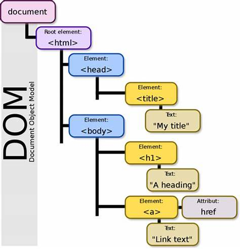
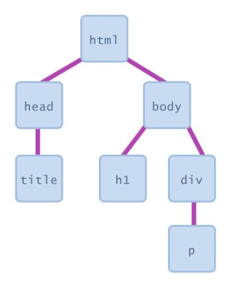

# Document Object Model (DOM)

Learning the ability to interact with the DOM is an important step to becoming a Web Developer. This readme will help you along your journey in familiarizing yourself with the DOM, manipulation methods and the HTML Tree.

## Table of Contents

- [Document Object Model (DOM)](#document-object-model)
- [Application Programming Interface (API)](#application-programming-interface-api)
- [DOM ELements](#dom-elements)
  - [Querying Elements](#querying-elements)
  - [Modifying Elements](#modifying-elements)
  - [Creating Elements](#creating-elements)
  - [Inserting Elements](#inserting-elements)
- [Event Listeners](#event-listeners)
- [DOM Events](#dom-events)

## Document Object Model

##### [Back to Top](https://github.com/bobbygrdn/JavaScript-Study-Sessions/blob/main/studyGuides/DOM.md#Document-Object-Model)



#### What is the DOM?

- The Document Object Model (DOM) connects web pages to scripts or programming languages by representing the structure of a document such as the HTML representing a web page in memory.
- The DOM represents a document with a logical tree. Each branch of the tree ends in a node, and each node contains objects. DOM methods allow access to the tree. Using these methods you can change the document's structure, style and content.
- A clear definition of the DOM is that the DOM is an API for interacting with a webpage.

#### What is a Document?

- The most common document is a web page.
- There are a number of ways we can represent a document:
  - Textually we can represent a document with HTML (How a developer sees a webpage)
  - Visually we can represent a document with the browser (How the user sees a webpage)
  - Digitally we can represent a document with the DOM (How a program sees a webpage)

#### How the DOM models a document

- The DOM models a document as an object. This allows us to interact with these objects easily.
- This object is not an ordinary object, it is a special data structure called a tree.
- The data structure is called a tree because of the nature in how it is visually represented to look like a real tree.
- This tree has a root node (trunk), the root node has nodes (branches), a node (branch) can have other nodes (branches). - A node contained in another node is known as the child node. - A node that contains another node inside it is known as the parent node.
  Let's look at a simple HTML example:

```html
<html>
  <head>
    <title>Some Title</title>
  </head>

  <body>
    <h1>Some Header</h1>

    <div>
      <p>text inside p inside div</p>
    </div>
  </body>
</html>
```

- This Simple HTML page can be modeled in a tree that looks like this:



- Looking at this tree we can pull out the following information:
  - The 'html' tag becomes the root node
  - It has 2 child nodes: 'head', 'body'
  - The 'head' node has a child node: 'title'
  - The 'body' node has 2 child nodes: 'h1', 'div'
  - The 'div' node has a child node: 'p'

## Application Programming Interface (API)

##### [Back to Top](https://github.com/bobbygrdn/JavaScript-Study-Sessions/blob/main/studyGuides/DOM.md#Document-Object-Model)

#### What is an API?

- An Application Programming Interface (API) is a set of features and rules that exist inside a software program enabling interaction with it through software as opposed to a human user interface.
- In contrast to a User Interface, which connects a computer to a person, an API connects computers or pieces of software to each other.
- APIs are not intended for direct use by a person or user, but instead be built, manipulated and used by a computer programmer.
- Web Developers use APIs to get the User Interface to talk to the Database of the application.

## DOM Elements

##### [Back to Top](https://github.com/bobbygrdn/JavaScript-Study-Sessions/blob/main/studyGuides/DOM.md#Document-Object-Model)

##### What are DOM elements?

- DOM elements are html tags represented by nodes and objects that can be manipulated using the DOM API.
- This allows us as programmers to manipulate the HTML Tree by selecting, modifying, creating and inserting elements in or into the tree.

### Querying Elements

##### [Back to Top](https://github.com/bobbygrdn/JavaScript-Study-Sessions/blob/main/studyGuides/DOM.md#Document-Object-Model)

#### How do you query or select a DOM element?

- DOM elements can be selected by using CSS selectors in the form of strings.
- There are five main ways to select elements using these selectors:
  document.getElementbyId( )

```javascript
<div id="newDiv">This is my new div.</div>

let select = document.getElementbyId('newDiv');

console.log(select); -> This will return the div with the id of 'newDiv'
```

document.getElementsbyTagName( )

```javascript
<a href="https://www.google.com">Let's ask Google!</a>

let item = document.getElementsbyTagName('a');

console.log(item); -> This will return what is called an HTML Collection that looks like this:
HTML Collection [a]
```

document.getElementsByClassName( )

```javascript
<div class="foostyle"></div>
<div class="foostyle"></div>
<div class="foostyle"></div>

let targets = document.getElementsByClassName('foostyle');

console.log(targets); -> This will return an HTML Collection that looks like this:
HTML Collection(3) [div.foostyle, div.foostyle, div.foostyle]
```

document.querySelector( )

```javascript
<a href="https://www.google.com">Let's ask Google!</a>

let target = document.querySelector('a');

console.log(target); -> This will return the anchor element that is shown above.
```

document.querySelectorAll( )

```javascript
<div class="foostyle"></div>
<div class="foostyle"></div>
<div class="foostyle"></div>

let targets = document.querySelectorAll('.foostyle');

console.log(targets); -> This will return a Node List that looks like this:
NodeList(3) [div.foostyle, div.foostyle, div.foostyle]
```

### Modifying Elements

##### [Back to Top](https://github.com/bobbygrdn/JavaScript-Study-Sessions/blob/main/studyGuides/DOM.md#Document-Object-Model)

#### What all can you do to DOM elements?

- There are many ways you can manipulate DOM elements to get the desired effect or look you want in your webpage.

- Here are some main ways you might want to manipulate your DOM elements:
  Setting an element's text

```javascript
element.textContent

// If we have an HTML element that looks like this:
<div id="myText">I have some text here</div>

// We can run this JavaScript to change the text of that element
let node = document.querySelector("#myText");

node.textContent = 'This is my new text I wanted to add!!';

console.log(node); -> This will return a statement that looks like this:
<div id="myText">This is my new text I wanted to add!!</div>
// Notice that the text has changed for the div

element.innerText

// If we have an HTML element that looks like this:
<h1>This is our title</h1>

// We can run this JavaScript to change the text of that element
let select = document.querySelector('h1');

select.innerText = 'I want this title instead';

console.log(select); -> This will return a statement that looks like this:
<h1>I want this title instead</h1>
// Notice that the text has changed for the h1
```

Working with Attributes

```javascript
element.attributes

// If we have an HTML element that looks like this:
<div id="someElem">A bit of text in here</div>

// We can run this JavaScript to view the attributes for the given element
let elem = document.getElementbyId('someElem');

console.log(elem.attributes); -> This will return a statement that looks like this:
NamedNodeMap {0: id, id: id, length: 1}
// This is an attributes object that shows us all the attributes of the given element
```

Working with Styles

```javascript
element.style.property = new style

// If we have an HTML element that looks like this:
<p id="para">Hello World!!</p>

// We can run this JavaScript to change the styling of this element
let myParagraph = document.getElementbyId('para');

myParagraph.style.color = 'blue';
// This will change the color of the text to blue

myParagraph.style.textDecoration = 'underline';
// This will add a line underneath the text

myParagraph.style.textAlign = 'center';
// This will align my text to the center of the page or parent element it is inside
```

Working with classes & Ids

- There are 3 ways we can interact with classes and Ids of our DOM elements:
  - className or id
  - classList
  - attributes

##### className or id

```javascript
// Let's start with an HTML element that looks like this
<div class="first"></div>

// Now let's query this element
let ourDiv = document.querySelector('.first');

// Now that we have access to the element, let's start using it
element.className

// We can run this JavaScript to change the class name of our HTML element
ourDiv.className = 'second'

console.log(ourDiv); -> This will return a statement that looks like this:
<div class="second"></div>
// Notice the change in the class of the HTML element

element.classList.add(CLASSNAME, ANOTHERCLASSNAME, ONEMORECLASSNAME)

// We can run this JavaScript to add class names to our div so we can further change the styling
ourDiv.classList.add('second', 'darkMode');

console.log(ourDiv); -> This will return a statement that looks like this:
<div class="second darkMode"></div>
// We can see that there are now two classes on this same div which we can use to interact with this element in different ways

element.classList.contains(CLASSNAME)

// We can run this JavaScript to change the text of each element based off of there class name
if(ourDiv.classList.contains('darkMode')) {
    ourDiv.textContent = 'Going Dark!!'
} else {
    ourDiv.textContent = 'I see the light!!'
}

console.log(ourDiv); -> This returns a statement that looks like this:
<div class="second darkMode">Going Dark!!</div>
// Notice how the text content to the div has changed based on the JavaScript we wrote above

element.classList.remove(CLASSNAME)

// We can run this JavaScript to change the classNames that are on our div
ourDiv.classList.remove('darkMode')

console.log(ourDiv); -> This will return a statement that looks like this:
<div class="second">I see the light!!</div>
// Notice how the class name DarkMode has been removed and the text has updated as well

element.classList.replace(CLASSNAME, ANOTHERCLASSNAME)

// We can run this JavaScript to change the className on our div
ourDiv.classList.replace('second', 'first');

console.log(ourDiv); -> This will return a statement that looks like this:
<div class="first">I see the light!!</div>
// Notice the change in the class for our div

element.classList.toggle(CLASSNAME)

// We can run this JavaScript to toggle the class name of our div
ourDiv.classList.toggle('darkMode');

console.log(ourDiv); -> This will return a statement that looks like this:
<div class="first darkMode">Going Dark!!</div>
// Notice how the darkMode class has been added and that caused our text to change

element.setAttribute('class', CLASSNAME ANOTHERCLASSNAME)

// We can run this JavaScript to change the classes on our div element
ourDiv.setAttribute('class', 'second darkMode');

console.log(ourDiv); -> This will return a statement that looks like this:
<div class="second darkMode">Going Dark!!</div>
// Notice how the class names have changed from first darkMode to second darkMode
```

Working wih Data-Attributes

```javascript

```

### Creating Elements

##### [Back to Top](https://github.com/bobbygrdn/JavaScript-Study-Sessions/blob/main/studyGuides/DOM.md#Document-Object-Model)

### Inserting Elements

##### [Back to Top](https://github.com/bobbygrdn/JavaScript-Study-Sessions/blob/main/studyGuides/DOM.md#Document-Object-Model)

## DOM Events

##### [Back to Top](https://github.com/bobbygrdn/JavaScript-Study-Sessions/blob/main/studyGuides/DOM.md#Document-Object-Model)

## Event Listeners

##### [Back to Top](https://github.com/bobbygrdn/JavaScript-Study-Sessions/blob/main/studyGuides/DOM.md#Document-Object-Model)
